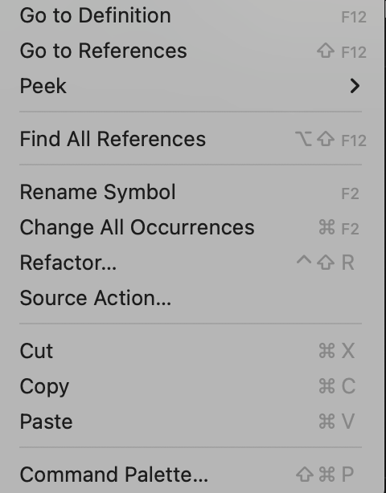

# Mark Down (md) 
Markdown md is for creating documentation in vs code. You can also create and save your notes here. If you want to see preview of this note, type this command and the preview will appear on right hand side:
1. (command + k) and
2. press v

# Format code in md notes
write your code inside three back ticks (```) and specify the language. E.g.,
``` js
var Increament = function (num) {
    return num++;
}
```
``` html
<title> Learning </title>
<h1> Heading</h1>
```
# Adding links for multiple pages for nodes
Write description or title of link in big bracke[] and add the file name in small brackets (). E.g.,

[Link to html notes](html-notes.md)
# git bash installation on mac

# To open vscode through cmd
Right click on folder and open terminal. Type command - "code ." 
If you get error as cmd not found then:
 1. go to vs code, right click and select command Palette.
 2. Type shell
 3. Select Install 'code' command PATH
 4. Inistall and run cmd again in terminal



